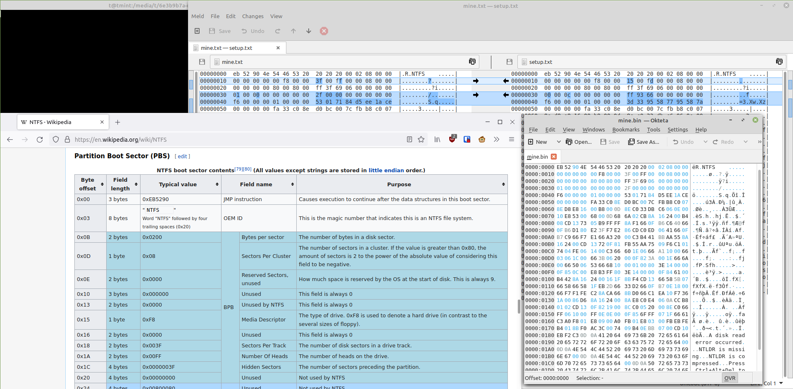

# Borgmatic config

This is what I use to backup my computers and servers. Unlike the traditional Borg model, here the server is more trusted than clients. The goal is to [achieve enlightenment](http://www.taobackup.com) and survive Ransomware.

- [Running](#running)
- [Mounting archives](#mounting-archives)
- [Restoring partitions](#restoring-partitions)
- [Setup](#setup)
- [Troubleshooting](#troubleshooting)
- [Tips](#tips)


## Running

```sh
/etc/borgmatic/run_create.py
```
```sh
borgmatic ...
```


## Mounting archives

1. Create a target directory:
    ```sh
    sudo mkdir /mnt/borg
    sudo chown $USER:$USER /mnt/borg
    ```
2. Find the archive to mount, for example with:
    ```sh
    borgmatic repo-list --last 5 -a "TAM_2009-*"
    ```
3. Mount it with:
    ```sh
    borgmatic mount --options=allow_root,uid=$UID,umask=007 --mount-point=/mnt/borg --archive=<archive_name>
    ```
4. When you are done, unmount it with:
    ```sh
    umount /mnt/borg
    ```

### Mounting partition images

<sub><sup>GUI instructions as you probably want to recover individual files while you still have a usable Linux with Desktop Environment</sup></sub>

1. With the File Manager (Nemo), navigate to `/mnt/borg`
2. Right-click the image file and click _Open With Disk Image Mounter_
3. Open _Disks_ (`gnome-disks`)
4. Click the loop device in the left pane, and then click the Play button to mount.
5. When you are done, unmount with the Stop button, and detach the loop device with the `–` button in the title bar (next to the Minimize button).


## Restoring partitions

<sub><sup>CLI instructions as in an emergency this may have to be run from the usually-headless Borg server!</sup></sub>

This section is mostly manual work because it shouldn't be used often, overwriting `/dev/sdX` is a delicate operation, and the case of multiple hard drives/partitions is complex.

Double-check the device you are about to write to!

1. Mount the archive (see previous section) and `cd` to that folder.

2. Add helper scripts to PATH:
    ```sh
    export PATH="/etc/borgmatic.d/restore:$PATH"
    ```

3. Run `3-backed_up_disk_structure.sh` to visualize data from `realdev_*.txt` and `sd?_header.bin` (how devices were at backup time).

    Use `sudo parted -l` to figure out about current target restore disks.

4. For each disk, restore its header (includes partition table) with:
    ```sh
    <sdA_header.bin sudo tee /dev/sdX >/dev/null
    ```

    After restoring for all disks, run:
    ```sh
    sudo partprobe
    ```

    and check restored disks with `sudo gdisk /dev/sdX`:

    > MBR:
    > ```
    > Partition table scan:
    >   MBR: MBR only
    >   GPT: not present
    > ```
    > GPT:
    > ```
    > Partition table scan:
    >   MBR: protective
    >   GPT: damaged
    > ```

    If the disk was GPT restore its backup partition table with `w`, else quit with `q`.

    <details>
    <summary>To restore to smaller GPT disk</summary>
    Assuming that the last partition is the Linux root, and only that one will be shrinked:

    1. `sudo gdisk /dev/sdX`
    2. Make write fail with `w`:
        ```
        Problem: partition 3 is too big for the disk.
        Aborting write operation!
        Aborting write of new partition table.
        ```
        This is actually required, as it changes the default _Last sector_ in step 5.
    3. Print partition table with `p`
    4. Delete last partition with `d`
    5. Recreate the partition with `n`. Accept all defaults.
    6. Write and exit with `w`.
    </details>

5.  Find raw images with:
    ```sh
    ll *.img
    ```

    Restore them with:
    ```sh
    5-extract-file-pv.sh <archive name> PART.img | sudo tee /dev/sdXY >/dev/null
    ```

    > Note: use `borg extract` instead of ./PART.img, because reading from the mounted filesystem is slow.

    However if they are NTFS and not too full and you don't care that empty space is not wiped with zeros, it may be faster to write only used data, even if reading from `./` is slower:
    ```sh
    ntfsclone --save-image --output - PART_NTFS.img |
      sudo ntfsclone --restore-image --overwrite /dev/sdXY -
    ```

    > Unfortunately `borg extract` can't be used with `--restore-image`, because the image is raw and not special-image (so it can be mounted), and _Only special images can be read from standard input_.

6.  Restore Linux root LVM partition:

    - Format and mount:
        ```sh
        sudo vgcreate machine_name /dev/sdXY

        # Get available space in VG in GiB:
        sudo vgs --noheadings -o vg_size /dev/machine_name

        # Remember to leave some space in VG for snapshots:
        sudo lvcreate --size 100G --name root machine_name

        sudo mkfs.ext4 -U "$(cat structure/serial_linux_root.txt)" /dev/machine_name/root
        sudo mkdir /mnt/borg_linux_target
        sudo mount /dev/machine_name/root /mnt/borg_linux_target
        ```

    - Find the matching Linux archive name in Borg repository

    - Extract:
        ```sh
        pushd /mnt/borg_linux_target
        sudo tamborg -pv extract --numeric-owner --sparse ::<archive name>

        # FIXME(extract): handle this with borgmatic instead (when tamborg alias is deleted)
        # "sudo tamborg" is failing SSH.
        # So currently tamborg and borgmatic have to be manually merged:
        sudo BORG_REPO=borg@192.168.0.64:TAM BORG_PASSCOMMAND='yq -r .encryption_passphrase /etc/borgmatic.d/config/config_storage.yaml' BORG_RSH='sh -c '\''sudo -u $SUDO_USER SSH_AUTH_SOCK="$SSH_AUTH_SOCK" /usr/local/bin/hpnssh -oBatchMode=yes -oNoneEnabled=yes -oNoneSwitch=yes "$@"'\'' 0' borg -pv extract --numeric-owner --sparse ::<archive name>
        # And permissions and dirs be fixed with:
        sudo chown -R $USER:$USER ~/{.config,.cache}/borg/
        sudo rm -rf /root/{.config,.cache}/borg/
        ```

    - Restore stuff:
        ```sh
        sudo su

        (umask 022; mkdir var/cache/apt)
        # No need to mess with `tmp` and `var/tmp` as they are automatically created.

        for s in etc/borgmatic.d/restore/machine_specific/*.generated.sh; do $s; done
        exit
        ```

    - Finalize:
        ```sh
        popd
        sudo umount /mnt/borg_linux_target
        ```

    > Try to remember what has to be regenerated :s. For example, the Poetry virtualenv (in ~/.cache/) for a project run by cron. Dockerized apps shouldn't have this problem.

7. Restore data:
    - Boot into restored Linux to have GUI
    - Format partition with its previous filesystem
    - Restore its serial from `structure/serial_xxxx.txt`:
      - NTFS: `sudo ntfslabel --new-serial=<serial> /dev/sdXY`
      - exFAT: `sudo tune.exfat -I <serial> /dev/sdXY`
    - Mount
    - Open a terminal at mount point and run:
        ```sh
        tamborg extract --strip-components 1 ::<archive name> PART/
        ```
        This assumes backup uid matches restore uid.
    - If you then realize that some important NTFS metadata is missing, you may try recovering it by converting the `.metadata.simg` to VHD with https://github.com/yirkha/ntfsclone2vhd/#metadata-only-images, and mounting it in Windows.

    > However, after restoring special files:
    > - Hardlinks work fine
    > - Relative symlinks work on Linux
    > - Absolute symlinks and junctions are broken on Linux but could be restored:
    >   ```
    >   /media/user/ntfs_test_restored $ ll
    >   ... 'Junction of folder' -> /mnt/borg_pata/ntfs_test/folder
    >   ```
    > - Symlinks and junctions are screwed on Windows. They are regular files, with some prefix and then text with the Linux's target path :(
    >
    > TODO(extract): same with ntfs3?


## Setup

0. Requirements:
    - Debian / Linux Mint / Ubuntu 20.04+, installed on LVM
    - Encrypted filesystems are currently unsupported
    - sudo [NOPASSWD](https://xkcd.com/1200/)

1. Create projects "Borg" and "HDD Smart" at [healthchecks.io](https://healthchecks.io).

1. Clone this:
    ```sh
    sudo apt install git

    sudo SSH_AUTH_SOCK="$SSH_AUTH_SOCK" GIT_SSH_COMMAND="sudo -u $USER ssh" git clone git@github.com:zzdroide/borgmatic.git /etc/borgmatic
    ```
    For ease of usage, also run:
    ```sh
    sudo chown -R $USER:$USER /etc/borgmatic
    ```

1.
    ```sh
    (umask 077 && cp -r /etc/borgmatic/{config_example,config})
    cd /etc/borgmatic/config/
    ```
    And configure:

    - `constants.yaml`: see comments.

    - `bupsrcs.cfg`: &lt;type> &lt;name> &lt;path>

      Where &lt;type> is:
      - `linux` for an ext4 linux root or data partition. Must be a LV and have free space in the VG for a snapshot, to backup while in use.
      - `part` to backup the raw partition
      - `data` to backup file data only (exFAT-style)

    - `smarthealthc.cfg`: &lt;hc_url> &lt;dev>

      One line for every mechanical HDD worth preventative replacement.


    > Note: *.cfg files can have comments by starting lines with `#`

1.
    ```sh
    /etc/borgmatic/scripts/setup.sh
    ```

1. (Optional) If you want automatic backups triggered by the server:

    - Install and enable openssh-server
    - Add the following line to `~/.ssh/authorized_keys`
      ```
      command="systemctl --user start tamborgmatic-auto.service",restrict ssh-ed25519 AAAAC3NzaC1lZDI1NTE5AAAA... tamborgcont
      ```
    - Symlink a service from `automation/` to `~/.config/systemd/user/tamborgmatic-auto.service` (or copy+edit if you need a mix).

1. Configure `server_user` on server.


### Development setup

```sh
poetry env use python3.13
poetry sync
eval $(poetry env activate)
pre-commit install
```


## Troubleshooting

### Borgmatic fails with `borg.remote.ConnectionClosed: Connection closed by remote host`

This is most likely the ssh hook rejecting the connection. Confirm this by running again but adding `-v2`. Now the output will contain: _Got unexpected RPC data format from server: Repo is NOT OK_

### Windows can't mount NTFS partition

If the restored partition can't be mounted (Disk Manager shows it as healthy, but most options are greyed out, and `DISKPART> list volume` doesn't show it), check the partition type with `sudo fdisk -l /dev/sdX`.

|   | MBR             | GPT                  |
| - | --------------- | -------------------- |
| ✓ | HPFS/NTFS/exFAT | Microsoft basic data |
| ✗ | Linux           | Linux filesystem     |

If for some unknown reason the partition type is not correct (happened to me once), change it with `sudo fdisk /dev/sdX`, command `t`.

### NTFS boots to blinking cursor (after resizing/moving/messing with partitions)

<details>
<summary>Explanation</summary>
Windows booting can be quite fragile, specifically Windows XP on MBR.

The NTFS bootsector has some legacy Cylinder/Head/Sector shit configured into it, and if it's wrong it just boots into a blinking cursor. This is vaguely documented in
[ntfsclone](https://man.archlinux.org/man/ntfsclone.8#Windows_Cloning)
and [partclone.ntfsfixboot](https://man.archlinux.org/man/partclone.ntfsfixboot.8)
(at least its source code [links](https://thestarman.pcministry.com/asm/mbr/NTFSBR.htm) to way too much detail).

- `jaclaz` explains
    [here](https://reboot.pro/index.php?showtopic=8233#post_id_70088)
    ([local copy](readme_data/xpboot/jaclaz.html#post_id_70088))
    where the problem is (note that he made a typo and wrote 0x0A,0x0C instead of 0x1A,0x1C),

- but I couldn't fix it with Testdisk
    [1](https://web.archive.org/web/20131005134310/http://www.xtralogic.com/support.shtml#faq_vhdu_disk_read_error)
    [2](https://web.archive.org/web/20131226114035/http://www.xtralogic.com/testdisk_rebuild_bootsector.shtml)
    (local
    [1](readme_data/xpboot/testdisk1.shtml#faq_vhdu_disk_read_error)
    [2](readme_data/xpboot/testdisk2.shtml)),

- nor by booting the XP disk, going into the recovery console, and running `fixmbr`, `fixboot`, `bootcfg /rebuild`,

- nor by booting the affected computer with BartPE, and running Bootice there.

- Rescuezilla explains
[why these attempts fail](https://github.com/rescuezilla/rescuezilla/blob/2.4.2/src/apps/rescuezilla/rescuezilla/usr/lib/python3/dist-packages/rescuezilla/parser/chs_utilities.py).
However I haven't tried this EDD method, just because I hadn't found it at the time.

What did work for me, was to let Windows setup generate the correct numbers, and plug them into my unbootable NTFS:

1. Backup the entire disk containing the unbootable NTFS (recommended), or just the unbootable NTFS partition and the first 512 bytes of the disk (MBR).

2. Begin to install a new Windows into this affected disk. Do not let the installer delete/create/resize partitions, just format the unbootable NTFS partition and install there.

3. When the installer reboots to continue by booting from disk instead of from installation media, confirm that it actually boots and stop it.

4. Backup the first 512 bytes of the now bootable NTFS partition (PBR), and then overwrite this now bootable partition with the unbootable one.

5. Compare the PBRs of the partitions, and change the relevant bytes (0x18-0x1F) in the unbootable one. Serial number for example (0x48-0x4F) is irrelevant, and MFT clusters (0x30-0x3F) should not be changed.

    

6. Overwrite the recently written Windows MBR on disk with the previous backed up MBR, to restore booting to GRUB.
</details>

#### Summary
```sh
# In Ubuntu, in same computer as non-working NTFS boot, which is for example /dev/sdXY:
sudo apt install -y lz4
cd somewhere_with_lots_of_free_space
sudo dd if=/dev/sdX of=mbr.bin count=1
sudo ntfsclone --save-image --output - /dev/sdXY | lz4 - unbootable_ntfs.simg.lz4

# Then insert Windows XP setup CD and boot it. Remember to press F6 and have floppy disk if required.
# Refuse to repair existing installation, and press lots of keys to install new Windows and just format (quick) the affected partition, without deleting the partition itself or altering anything else.
# After formatting, when setup is copying files, forcefully reboot the computer 🔥

# Now boot a live Ubuntu iso, as the MBR will be screwed and nothing will boot. (Advanced alternative: use the iso's GRUB to boot the installed Ubuntu in hard drive instead)
sudo apt install -y lz4
cd the_previous_folder
sudo dd if=/dev/sdXY bs=8 skip=3 count=1 of=magic_numbers.bin
lz4 -dc unbootable_ntfs.simg.lz4 | sudo ntfsclone --restore-image --overwrite /dev/sdXY -
sudo dd if=magic_numbers.bin of=/dev/sdXY bs=8 seek=3
sudo dd if=mbr.bin of=/dev/sdX
# Reboot and in GRUB choose Windows 😈
```

### There's a ghost/zombie/leftover/nonexistant `/dev/machine_name/root`
```sh
sudo dmsetup remove /dev/machine_name/root
```


## Tips

### Veracrypt containers

By default Veracrypt doesn't change the modified date of container files. So they are always skipped after the first backup, unless the files cache is purged.

You can disable _Preserve modification timestamp of file containers_ in [_Preferences_](https://github.com/veracrypt/VeraCrypt/issues/209#issuecomment-329992402).
